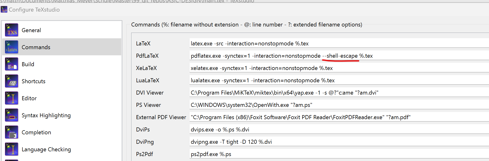

# ASIC-DESIGN
When miktex is installed add curfile

Add the shell escape flag to texstudio [see also the following link](https://tex.stackexchange.com/questions/99475/how-to-invoke-latex-with-the-shell-escape-flag-in-texstudio-former-texmakerx)
`--shell-escape`

Add the folowing to the path `C:\tools\miniconda3\Scripts\`

Execute the follownig three commands in the anaconda prompt:

```console
conda init cmd.exe
conda init powershell
conda init bash
```

Go to the base environment and execute (in administrator mode):
`conda install pygments -y`