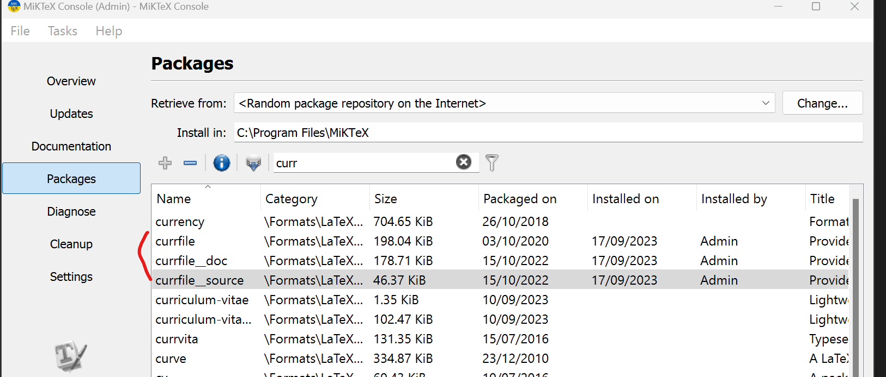

# ASIC-DESIGN
When miktex is installed add curfile

Add the shell escape flag to texstudio [see also the following link](https://tex.stackexchange.com/questions/99475/how-to-invoke-latex-with-the-shell-escape-flag-in-texstudio-former-texmakerx)
`--shell-escape`

Add the folowing to the path `C:\tools\miniconda3\Scripts\`

Execute the follownig three commands in the anaconda prompt:

```console
conda init cmd.exe
conda init powershell
conda init bash
```

Go to the base environment and execute (in administrator mode):
`conda install pygments -y`

## Running it with vs code
Add the follwoing in your ```settings.json``` file:
```json
 "latex-workshop.latex.tools": [
        {
          "name": "latexmk",
          "command": "latexmk",
          "args": [
            "-synctex=1",
            "-interaction=nonstopmode",
            "-file-line-error",
            "--shell-escape",
            "-pdf",
            "%DOC%"
          ]
        },
        {
          "name": "pdflatex",
          "command": "pdflatex",
          "args": [
            "--shell-escape",
            "-synctex=1",
            "-interaction=nonstopmode",
            "-file-line-error",
            "%DOC%"
          ]
        },
        {
          "name": "bibtex",
          "command": "bibtex",
          "args": [
            "%DOCFILE%"
          ],
          "env": {}
        },
        {
            "name": "biber",
            "command": "biber",
            "args": [
                "%DOCFILE%"
            ]
        }
      ],
      "latex-workshop.latex.recipes": [
        {
            "name": "pdflatex ➞ bibtex ➞ pdflatex × 2",
            "tools": [
                "pdflatex",
                "bibtex",
                "pdflatex",
                "pdflatex"
            ]
        }
      ],
      "latex-workshop.latex.recipe.default": "pdflatex ➞ bibtex ➞ pdflatex × 2",
```